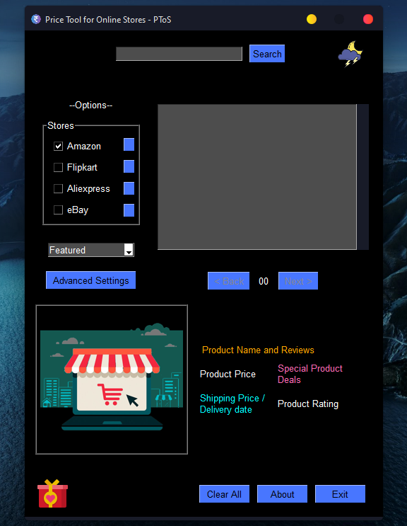

# PToS
PToS - Price Tool for Online Stores
## About project
Made for a school project. We had to make a program using different modules. I've used quite a few here.<br>
It'll calculate prices for the product searched by user in different stores (Amazon.in, Flipkart.com, AliExpress.com, eBay.com) and display the products in a listbox in any one of three ways (Low to high, High to low and Featured(randomized)) along with other useful info (price, shipping price, shipping date, origin country, ratings, reviews, special deals).<br>
It can also bar products with ratings lower than a certain rating, prices higher than a certain price or without free shipping from being displayed.
## Image


## REQUIREMENTS:
None if you use the .exe, if you want to run the py file -><br>
1. [Python 3](https://www.python.org/downloads/): I use 3.9
2. [PySimpleGUI](https://pysimplegui.readthedocs.io/): Python library for GUI development. Install it using ```pip install pysimplegui``` in Command Prompt.
3. [Selenium](https://selenium-python.readthedocs.io/): Python library for web automation. Install it using ```pip install msedge-selenium-tools selenium``` in Command Prompt. (Note - I use Selenium Tools for Microsoft Edge, not the one maintained by SeleniumHQ)
4. [BeautifulSoup](https://www.crummy.com/software/BeautifulSoup/): Python library for parsing HTML. Install it using ```pip install bs4``` in Command Prompt.
5. [Requests](https://requests.readthedocs.io/): Python HTTP library. Install it using ```pip install requests``` in Command Prompt.
6. [Pillow (a PIL fork)](https://pillow.readthedocs.io/): Python library for image manipulation. Install it using ```pip install pillow``` in Command Prompt.
## Usage:
1. Open the program
2. Program's pretty self explanatory

\
\
[](https://opensource.org/licenses/MIT)<br>
Made with :heart: by Meghraj Goswami<br>
For Terms of Service visit https://bit.ly/3aeIVfl
